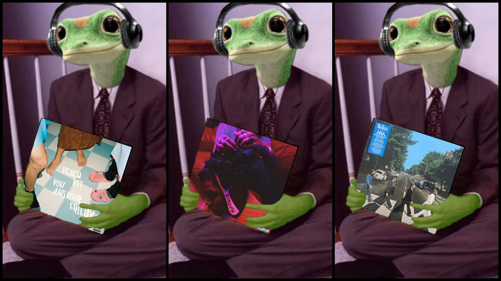

# Martin Music


<p align="center">
  <a href="https://github.com/reesehatfield/martin-music">
    
  </a>
</p>

<h3 align="center"><strong>Martin Music</strong></h3>

<p align="center">
    Generate images of Martin holding your favorite albums
    <br>
</p>

## Prequisites:
- Golang


## Getting Started:

First clone this repo width
```bash
git clone https://github.com/ReeseHatfield/martin-music.git
cd martin-music
```

Once you have golang installed, generating an image of Martin holding your favorite album cover is easy.
Simply create a text file, where each line is `Album Title - Artist Name`. For example:
```
You and Your Friends - Peach Pit
Blkswn - Smino
Abbey Road - The Beatles
```

Once you have created the file, simply pass the filepath as an argument to `martin.sh`

```bash
chmod u+x martin.sh
./martin.sh album_file_path.txt
```

After a while, the `out/` directory will contain your martin images


# Acknowledgements

Thanks to [Nathan Weiland](https://www.nathanweiland.com/) for the image template of Martin